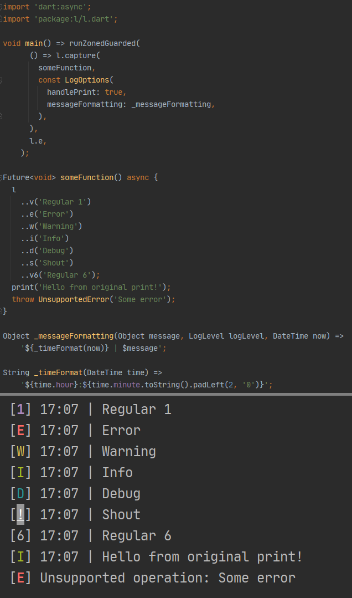

# [L]ogger  
  
  
  
[](https://github.com/PlugFox/l/actions)
[](https://pub.dev/packages/l)
[](https://pub.dev/packages/l)
[](https://pub.dev/packages/l/score)
[](https://en.wikipedia.org/wiki/WTFPL)
[](https://github.com/plugfox/l)
[](https://github.com/tenhobi/effective_dart)
[](https://github.com/PlugFox/l/)
  
  
## About  
Cross-platform html/io logger with simple API.  
No need to create an logger object. Just import and use. Simple and w/o boilerplate.  
Work with native console.  
  
  
<!---->
  
---
  
## Core API  
  
### Key features  
  
|     Method     | Description                          |
|----------------|--------------------------------------|
| [s]            | A shout is always displayed          |
| [v1], [v]      | Regular message with verbose level 1 |
| [e]            | Error message with verbose level 1   |
| [v2], [vv]     | Regular message with verbose level 2 |
| [w]            | Warning message with verbose level 2 |
| [v3], [vvv]    | Regular message with verbose level 3 |
| [i], [<]       | Inform message with verbose level 3  |
| [v4], [vvvv]   | Regular message with verbose level 4 |
| [d], [<<]      | Debug message with verbose level 4   |
| [v5], [vvvvv]  | Regular message with verbose level 5 |
| [v6], [vvvvvv] | Regular message with verbose level 6 |
  
```dart
l.s('shout me');
l.e('error msg');
l.w('warning msg');
l.i('info msg');
l < 'alt info msg';
l.d('debug msg');
l << 'alt debug msg';
l.v('verbose lvl #1');
l.vv('verbose lvl #2');
l.vvv('verbose lvl #3');
l.v4('verbose lvl #4');
l.v5('verbose lvl #5');
l.v6('verbose lvl #6');
```  
  
  
### Integration capabilities  
  
|     Method     | Description                       |
|----------------|-----------------------------------|
|    [listen]    | Broadcast stream receiving logs.  |
  
```dart
// Broadcast stream instantly receiving logs.
l.forEach((log) => print('* ${log.level} : ${log.message}'));
```  


### Print handling and customizing  
  
Logger supports fine-tuning.
Also, you can handle `print` and output with `l` on some function or in a whole app with this simple syntax:  
  
```dart
import 'package:l/l.dart';

void main() => l.capture(
      someFunction,
      const LogOptions(
        handlePrint: true,
        messageFormatting: _messageFormatting,
      ),
    );

Future<void> someFunction() async {
  print('Hello');
  await Future<void>.delayed(const Duration(milliseconds: 150));
  l.d('world');
  await Future<void>.delayed(const Duration(milliseconds: 150));
  l.e('!!!');
}

Object _messageFormatting(Object message, LogLevel logLevel, DateTime now) =>
    '${now.hour}:${now.minute.toString().padLeft(2, '0')} $message';
```  
  
---

## Handling errors  

### Flutter

```dart
final sourceFlutterError = FlutterError.onError;
FlutterError.onError = (details) {
  l.w(details.exceptionAsString(), details.stack);
  sourceFlutterError?.call(details);
};
```
  
### Crashlytics

```dart
l.where((msg) => msg.level.maybeWhen(
      error: () => true,
      warning: () => true,
      orElse: () => false,
    ))
  .map<String>((msg) => msg.message.toString())
  .listen(FirebaseCrashlytics.instance.log);
```
  
### Zoned Errors

```dart
runZonedGuarded(someFunction, l.e);  
```
  
### Handling uncaught errors  
  
```dart
Isolate.current
       ..setErrorsFatal(false)
       ..addErrorListener(
         RawReceivePort(
           (List<dynamic> pair) => // ignore: avoid_types_on_closure_parameters
               l.e(pair.first as Object),
         ).sendPort,
       );
```    
  
---

### Output example  
  
    
  
  
---
  
## Limitations  
  
* When there is no direct access to the terminal, it works through print.  
* **!!! PLEASE, DO NOT LOG SENSITIVE INFORMATION !!!**  
  
  
---  
  
## Changelog  
  
Refer to the [Changelog](https://github.com/plugfox/l/blob/master/CHANGELOG.md) to get all release notes.  
  
  
---
  
## Maintainers  
  
[Plague Fox](https://plugfox.dev)  
  
  
---
  
## License  
  
[WTFPL](https://github.com/plugfox/l/blob/master/LICENSE)  
  
  
---
  
## Tags  
  
logger, log, logs, logging, logging-library, cross-platform, io, html  
  
  